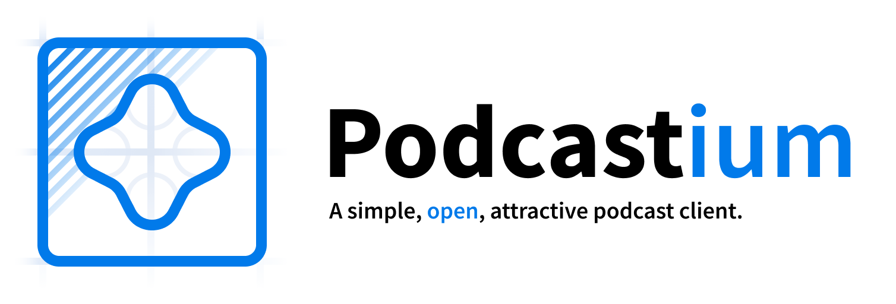

# 

**Podcastium** is a _project_ aiming to provide a simple, attractive and open-source
podcast client for Android and iOS.

Its goal is to follow the podcast creators' guidelines found in the
[_Podcasting is An Open Media_ manifesto](https://podcastouvert.fr/), proving that
a good and attractive podcasting experience can be provided by a free and _libre_ app.

## Under construction

There is no Geocities gifs here, but you get the idea: I am developing this during
my spare time, and it will take time before it can be used. Meanwhile, here are some good
apps that shares some of our goals:

* On Android, you can use the great and open-source [AntennaPod app](https://antennapod.org/),
  or the famous [PodcastAddict app](https://play.google.com/store/apps/details?id=com.bambuna.podcastaddict&hl=fr).
* On iOS, [Apple Podcasts](https://apps.apple.com/fr/app/apple-podcasts/id525463029) is a good
  player, but you can also find [Overcast](https://overcast.fm/) to be a good alternative.
